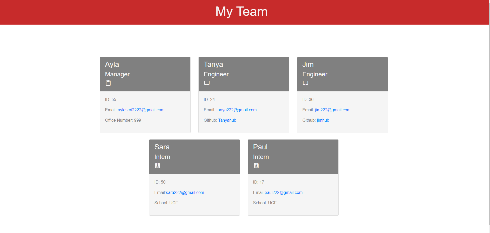

# Team Profile Generator

 
  
  
  
  
 

  ## Description
   Node.js command-line application that takes in information about employees on a software engineering team and generates an HTML webpage that displays summaries for each person.
  
 
  

  ## Table of Contents 
 * [Installation](#installation) 
 * [Usage](#usage) 
 * [Demo](#demo)
 * [Tests](#tests)
 * [License](#license)

  ## Installation 

  >*To install necessary dependencies, run the following command:*
  
 * Clone repository from GitHub and download `Node.js`.
 * Your application should use `Jest` for running the unit tests and  `Inquirer` for collecting input from the user. 

  ## Usage
    
  >*Instructions and examples for use:*
  
  * The application will be invoked by using  `node index.js`
  * [View walkthrough video on Screencastify](https://watch.screencastify.com/v/VW4ykfT07O57OUZ7JawR) 
  * [Team Profile Generator - Repo](https://github.com/Tari-Star/Challenge10-TeamProfile.git)

  
  
  ## Demo

  > Part 1

  

  > Part 2

  

  > Part 3

  

  ## Tests

  Use `npm run test` command to run Jest for unit tests

  ## License

    
  > This project is licensed under the  MIT license. 

  * [MIT license](https://choosealicense.com/licenses/mit) 
    
    
  
   ---
   
  ## Questions?

   
  
  
  For any questions, please contact me with the information below:
 
  GitHub: [@Tari-Star](https://api.github.com/users/Tari-Star)
  
   